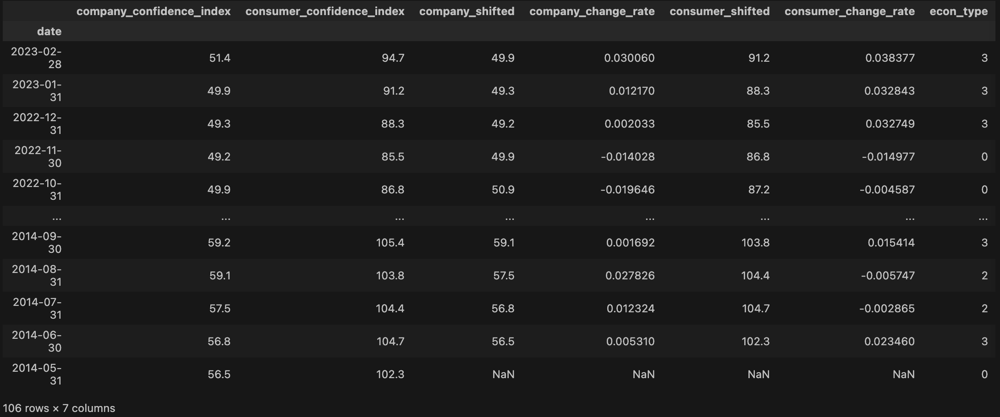

# 量化策略实例分享

厦门大学经济学院2022级金融专硕硕士生 WISERCLUB量化金融组组长  张安怡然

# 1. **主要框架摘要**

**大类资产配置权重**：核心思想是通过供需方信心指数的相对增长趋势判断经济周期并根据往届研报配置的经验为四大类基金（股票类、债券类、商品类、海外资产类）配置权重。

**股票类基金动量行业轮动**：核心思想是基于现有研报分析的91个细分赛道基金，计算其动量指标进行排序打分，选出前五只赛道ETF调仓。

**组合风险控制与利益优化：**核心思想是基于最小化-CVaR的目标函数和大类资产的权重限制，对每个细分资产进行权重分配。

**回测结果与反思：下个月月初利用上月月末收盘价调仓。**核心思想是月度调仓频率过于低，没有获益15年的暴涨反而受到15、18、20年影响导致回撤较大，需要加日度监视器和止损策略。另外，宏观到市场反应时间不具备时效性，可以将其改为观测大盘指数的趋势并切换为日调整。 

# 2. **大类资产配置**

1. 供需关系趋势分析 
2. 宏观经济形势判断        
3. 研报经验分配大类资产比例

## 2.1 供需关系趋势分析

**数据**：

​	**供给方**：中国中小企业信心指数（数据来源：渣打银行from 2014.5-2023.2）

​	**需求方**：消费者信心指数：预期指数（数据来源：国家统计局2014.5-2023.2）

**分析方法**：变化率分析，变化率为正即为上升趋势，否则，下降趋势。注意，序列不平稳，一阶差分后序列平稳但是为白噪声，不具有序列自相关性，用最简单的变化率分析趋势即可。

```python
# 计算变化率
macro_data['company_shifted'] = macro_data['company_confidence_index'].shift(periods=-1)
macro_data['company_change_rate'] = (macro_data['company_confidence_index'] - macro_data['company_shifted']) / macro_data['company_shifted']
macro_data['consumer_shifted'] = macro_data['consumer_confidence_index'].shift(periods=-1)
macro_data['consumer_change_rate'] = (macro_data['consumer_confidence_index'] - macro_data['consumer_shifted']) / macro_data['consumer_shifted']
macro_data
```


## 2.2 宏观经济形势判断

**数据**：变化率

**分析方法**：中小企业信心下降，消费者预期下降，衰退周期；中小企业信心上升，消费者预期上升，过热周期；中小企业信心上升，消费者预期下降，滞涨周期；中小企业信心下降，消费者预期上升，复苏周期。（纯属个人观点）

```python
# 衰退为0，过热为3，滞涨为2，复苏为1
macro_data['econ_type']=0
for i in macro_data.index:
    if macro_data.loc[i,'company_change_rate']>0 and macro_data.loc[i,'consumer_change_rate']>0:
        macro_data.loc[i,'econ_type']=3
    if macro_data.loc[i,'company_change_rate']>0 and macro_data.loc[i,'consumer_change_rate']<0:
        macro_data.loc[i,'econ_type']=2
    if macro_data.loc[i,'company_change_rate']<0 and macro_data.loc[i,'consumer_change_rate']>0:
        macro_data.loc[i,'econ_type']=1
    if macro_data.loc[i,'company_change_rate']<0 and macro_data.loc[i,'consumer_change_rate']<0:
        macro_data.loc[i,'econ_type']=0
macro_data
```




## 2.3 研报经验分配大类资产比例

在繁荣经济下中国股市反而不易繁荣，在衰退经济下中国股市反而繁荣的特征需要被考虑。对研报的参数进行调整：（0.6，0.15，0.15）


##  2.4 分配结果

```python
test_data
```


# 3. **股票类基金动量行业轮动**

## 3.1 原本思路

国内股票大类资产投资主要投资赛道ETF，形成行业轮动策略：行业因子

- 基本面因子（合成，万得因子库）：预期营收环比变化分位数、预期营收同比变化分位数、预期净利润环比变化分位数、预期净利润同比变化分位数、SUEO 共5 个指标等权合成Mark Fundamental

- 技术面因子：选用过去12个月的收益率以及信息比率等权合成作为动量因子ark MOM←

- 现金流因子：北向资金持仓市值占流通市值比、北向资金持仓市值占北向总持仓市值、北向持仓占比相对过去6个月均值变化、北向持仓占比6个月环比变化四个因子等权构造北向持仓因子Mark ＿SHSC。


以上三个因子等权合成赛道基础轮动因子，每个月选出评分最高的5个赛道

排除羊群效应：**拥挤度因子**（Turnover＿20d＿240d），首先剔除横截面上最为拥挤的1／3 的主题，然后基于 Mark Fundamental、Mark MOM、Mark SHSC 等权合成的 赛道指数评分，每月底选择得分最高的5个指数 

**但是从个股层面找ETF的因子再组合起来数据量太大了：10\*91\*十年交易日\*好多指标，电脑可能得G，所以只做ETF层面的动量指标MTM和MTMMA。**

**MTM**是N日前收盘价减去今日收盘价，MTMMA是其M日移动平均。但是单独用MTM和MTMMA随机组合一下的因子多半不靠谱，于是我又进行了简单数学推演，发现用时间序列建模后的MTM滞后项系数可以很好的反应股价动量指标。


**于是抓几个小白鼠MTM发现其为平稳序列而且可以用AR（2）建模分析：**

```python
from statsmodels.tsa.stattools import adfuller

result = adfuller(mtm)
print('ADF Statistic: %f' % result[0])
print('p-value: %f' % result[1])
```


```python
最终用  select_sore_num=700*beta1+300*beta2
```

**评选前5个code，放进本月调仓标的里面。**

# **4. 组合风险控制与利益优化**

数据：

- 国内股票类标的：行业轮动选择的五只赛道ETF
- 国外股票类标的：标普500ETF
- 国内债券类标的：中债国债总财富指数、中证企业债指数（注：债券类资产加1.4 倍杠杆）；考虑到 FOF 最终的投资标的是基金产品，而债券类基金通常加入一定杠杆,我们对选用的债券类指数进行 1.4 倍杠杆的模拟操作。
- 商品类资产标的：黄金现货

**计算CVaR：条件风险价值（CVaR）模型是指在正常市场条件下和一定的置信水平1-α上，测算出在给定的时间段内损失超过VaR值的条件期望值。（一般为负数，越大越好）**

```python
# 计算给定参数下的投资组合的CVaR
def cvar(weights, expected_returns, cov_matrix, alpha):
    # 计算组合的预期收益率
    port_return = weights.dot(expected_returns)
    # 计算组合的标准差
    port_std = np.sqrt(weights.dot(cov_matrix).dot(weights))
    # 计算VaR
    var = port_return - norm.ppf(alpha) * port_std
    # 计算CVaR
    cvar = (1/alpha) * norm.pdf(norm.ppf(alpha)) * port_std - port_return
    return cvar
```

**定义目标函数：目标最小化极端风险**

```python
# 最小化CVaR函数的负值
def objective(weights, expected_returns, cov_matrix, alpha):
    return -cvar(weights, expected_returns, cov_matrix, alpha)
```

**每个月的都加上约束算一遍weight**

```python
for year_month in test_data.index:
    
    input_dir1 = 'cov_matrix' 
    input_dir2='retern_matrix'
    for filename in os.listdir(input_dir1):
        if year_month==filename.split('.')[0]:
            input_path1 = os.path.join(input_dir1, filename)
            asset_code = filename.split('.')[0]

            cov_matrix = pd.read_csv(input_path1)
        
            input_path2 = os.path.join(input_dir2, filename)
            asset_code = filename.split('.')[0]

            expected_returns = pd.read_csv(input_path2)
            # 初始化数据
            n_assets = 9
            expected_returns = expected_returns.mean().values
            cov_matrix = cov_matrix.values[:,1:]
            alpha = 0.05
            # 设置初始权重
            n_assets = len(expected_returns)
            initial_weights = np.array([1/n_assets for i in range(n_assets)])
            constan_list = test_data[test_data.index==year_month].values[0][1:]
            # 设置约束条件
            bounds = [(0, 1) for i in range(n_assets)]
            constraints = [
                {'type': 'eq', 'fun': lambda weights: np.sum(weights) - 1},
                #{'type': 'ineq', 'fun': lambda weights: cvar(weights, expected_returns, cov_matrix, alpha) - alpha},
                {'type': 'eq', 'fun': lambda weights: constan_list[0] - np.sum(weights[:5])}, # stock
                {'type': 'eq', 'fun': lambda weights: constan_list[1] - np.sum(weights[[5,7]])}, # bonds
                {'type': 'eq', 'fun': lambda weights: constan_list[2] - weights[6]}, # gold
                {'type': 'eq', 'fun': lambda weights: constan_list[3] - weights[8]} # overseas
            ]

            # 调用优化器求解
            result = minimize(objective, initial_weights, args=(expected_returns, cov_matrix, alpha), bounds=bounds, constraints=constraints)

            # 输出结果
            tem_choice_df = pd.DataFrame([list(result.x) + [result.fun] + [year_month]])
            tem_choice_df.columns = sub_test_data.columns
            sub_test_data = pd.concat([sub_test_data,tem_choice_df])
            print('CVaR:', -result.fun)
```

**补充说明：cov_matrix的求法只用了普通的算协方差的方法，因为各个收益率序列是白噪声，没办法用DCC-GARCH或者其他复杂时间序列相关方法。**

**平稳性通过，自相关性和异方差性都未通过。** 

# 5. **回测结果与反思**


作为一个FOF产品，单从年化角度来说还是可以的，但是没有躲过20年，15年，18年的大幅度下跌，造成了很大的回撤。


和上证指数比较我们可以看到这个策略没有得到15年拉升的红利，而且每一次股票的下跌这个策略回撤都有参与。

# **展望与改进：**

**后期打算做一个日度跟踪器为回撤设置止损点，并且将宏观数据的判断改为对大盘指数的判断。**

# **Backrtader 使用注意事项：**

1. **导入数据的时候open close high low volume都要导入，回测框架如果使用close储存记录会看第二天的open，如果open为0会被默认停牌。会被认为买了一个然后退市的资产**
2. **多个资产建议用pyfolio画图**
3. **Backtrader不太支持全仓all in, 可能会存在买不进的情况**
4. **下载数据最好在wind将数据日期进行对齐，如果已经日期无法对齐可以用“tushare”把上证指数下载下来直接在代码里面对齐。**
5. **可以使用一个pickle储存对齐好的dataframe交易数据和交易信号以及交易信息等等等等。**