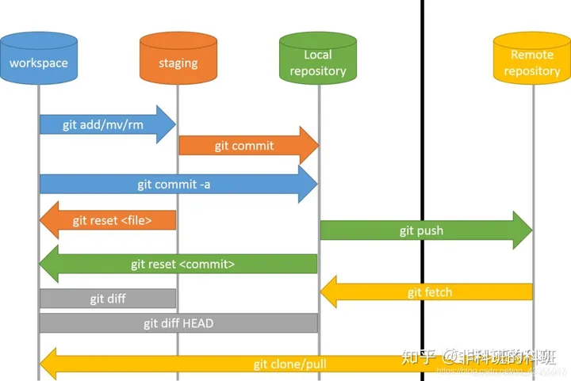
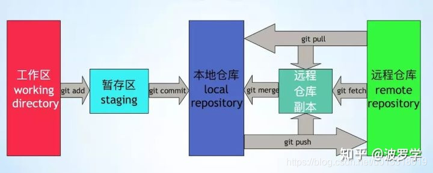
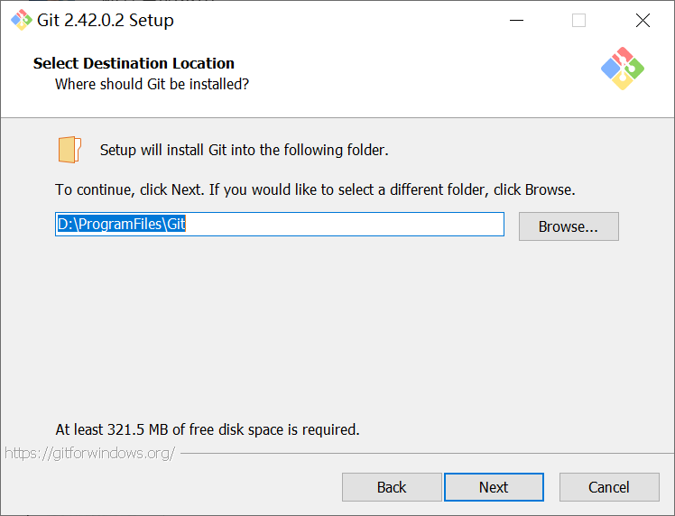
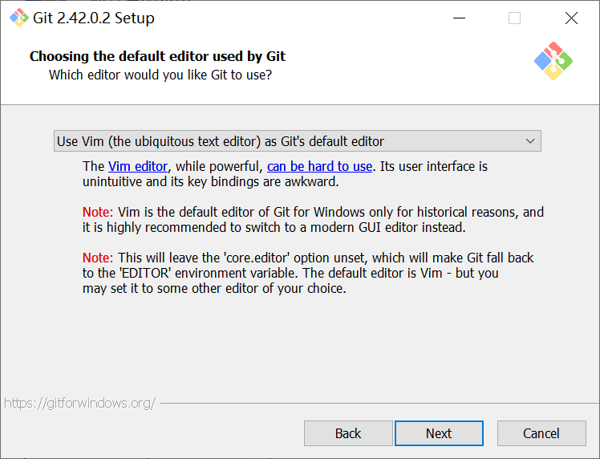
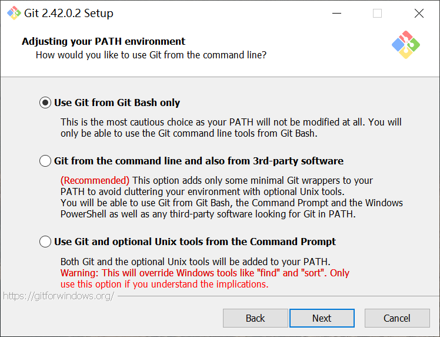
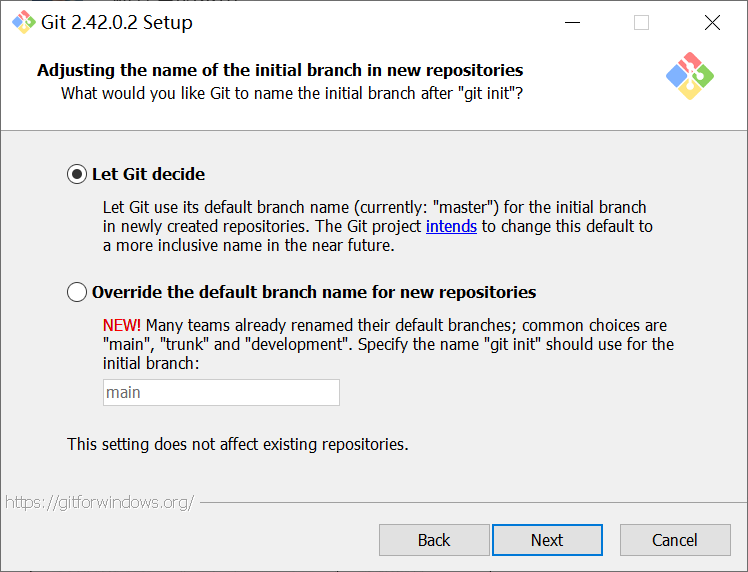
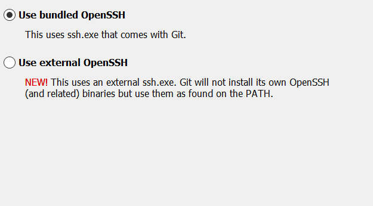
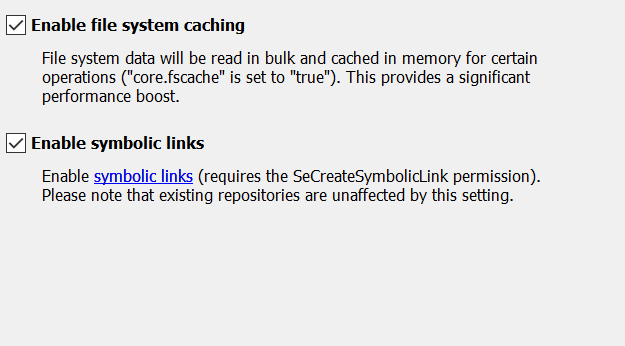
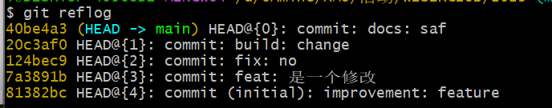
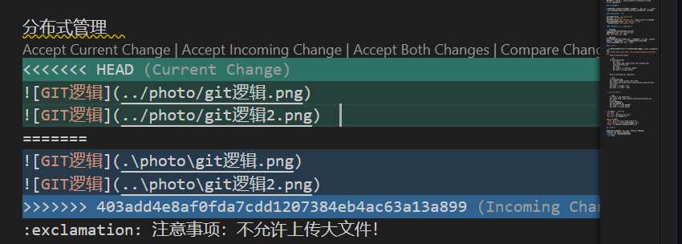

# 教学文档-GIT

作者：吴智悦  
用途：本文档用于 GIT 的使用教学和规范说明

## 1、club的git  

联系组长获取，且注意保密，**不得外借！**  

## 2、GIT项目管理逻辑  

分布式管理  
  
  
:exclamation: 注意事项：不允许上传大文件！  

远程库：gitlab【局域网】、 github、gitee 【互联网】  

## 3、git安装

【可以直接搜索网上的教程进行安装】  
[git官网](https://git-scm.com/download/win)  

安装目录要求：无中文+无空格  
  

安装选项：大部分默认即可，语言选择 vim  
  

除了：use git Bash only 和 let git decide  
  
  
  
  

我们使用的是 vscode 进行编写，在安装完 git 以后  
vscode 左下角 setting 输入 git.path  
在 "git.path": "D:/ProgramFiles/Git/cmd/git.exe" 输入安装路径  
随后关闭 setting 保存更改  
在左侧第三个图标 source control 中 reload 或者直接重新打开 vscode  
最后看到链接成功

## 4、git教学

master/main分支：版本分支，最核心的、最稳定的  
【现在的github新项目都已经是main作为主分支】  
develop分支：开发中的  
future分支：新功能A/功能B...对应新特性  
release分支：从develop创建，进行测试和文档，最后合并到master中  
hotfix分支：从master创建，修复  

**基本流程**：在自己的future分支上开发最后合并到master分支（需要经过审核）  

### 1） 首次安装后，设置用户签名  

```git
git config --global user.name xxx
git config --global user.email xxx@xxx.com
```

**为了方便识别身份，此处的的用户名统一设置为 年级-小组-姓名全拼**  
2022-QUANT-WuZhiyue  
2022-SQL-WuZhiyue  
2022-PYTHON-WuZhiyue  
**邮箱可以是假的也可以是真的**  
为了方便后续可能的联系，请大家提交真实的邮箱  
如果大家有github账号的话可以设置成一致的邮箱  

`git config –-list` 查看 user.name 和 user.email 是否设置成功  
`git config --global --edit` 直接修改配置文件  
找到该配置文件进行修改:目录在 电脑-用户-（隐藏文件） .gitconfig

### 2） 初始化本地库  

`git init`在目标目录输入（cd 或者直接在目录处打开bash）  
`git status`查看该 git 项目的状态  

### 3）文件添加到暂存区  

`git add 文件名/文件夹名`  在暂存区添加指定文件/文件夹  
`git add .`  所有改动加入暂存区以备提交（不改动的不变）  
`git rm --cached 文件名` 用于从暂存区删除文件  

### 4）文件添加到本地库  

`git commit -m "commit message" 文件名`  添加到本地库  
按照规定填写 commit message（首次上传填写「initial commit」），**type 和 subject 必选**  

```git
<type>(<scope>): <subject>
// 空一行
<body>
// 空一行
<footer>
```  

>1. type:  
    feat：新功能（feature）  
    fix/to：修补bug  
    docs：文档（documentation）  
    style： 格式改变（不影响代码运行的变动）  
    refactor：重构（即不是新增功能，也不是修改bug的代码变动）  
    test：增加测试  
    chore：构建过程或辅助工具的变动  
>2. scope:  
    scope用于说明 commit 影响的范围（项目名/模块名），比如数据层、控制层、视图层等等，视项目不同而不同  
>3. subject:  
    subject是 commit 目的的简短描述，不超过50个字符  
    - （英文）小写开头  
    - 动词开头，使用一般现在时  
    - 结尾不带标点符号  
>4. body:  
    Body 部分是对本次 commit 的详细描述，可以分成多行
>5. footer:  
    只适用于：  
    1） 出现不兼容变动（break changes）  
    2） 影响了某个问题（affect issues）

为了规范使用，我们安装（全局安装）：  
  `npm install -g commitizen`  
  `npm install -g cz-conventional-changelog`  
  `commitizen init cz-conventional -changelog --save --save-exact`  

随后 `git cz` 代替 `git commit -m`  
会出现选项，选择 type(填写数字) 和 填写 subject、body  
body部分如果不需要写-直接敲回车  
如果想要写完整的内容/自由填写 `git commit` 后会出现一个文本填写区域  
产生修改以后要重新执行 add - commit 才能到本地库

### 5） 版本穿梭

`git reflog` 查看日志/版本历史  
`git log` 详细 log（可以看到是谁提交和邮箱、时间等等）
>`git log` 在提交次数多的情况下会出现「溢出」，此时可以使用键盘上下键或者鼠标查看全部内容，随后使用「q」、「Q」或者「ZZ」退出查看模式  

  
图中黄色的就是版本号，目前我们在 40be4a3 这个版本  
`git reset --hard 81382bc` 表示回到最早的版本 81382bc  
这个操作在 reflog 中也会显示，会显示为「moving to xxx」  
本质上是指针的移动  

### 6）分支操作

在切换分支前，要确保本分支的所有内容都进行了 `add` 和 `commit`
也就是提交到了本地库，否则会导致分支和main的内容一起改变。

#### ① 新建、切换和删除

新建分支「dev」  `git branch dev`  
查看分支 `git branch -v`  
切换分支「dev」 `git checkout dev` ，会自动关联远程同名分支  
新建并切换分支「dev」 `git checkout -b dev`  
删除分支「dev」 `git branch -d dev`  

#### ② 分支合并-本质也是指针的移动

1. 正常合并  
把新建的分支「dev」合并到「master」中  
首先切换到 master `git checkout master`  
然后 `git merge dev` 即可

2. 冲突合并  
合并分支的时候，两个分支都对同一个文件的同一个位置进行了修改  
可以通过删除修改的方式进行，系统会直接显示不同之处  
修改完以后记得还是要 `add` `commit`

  

#### ③ 远程库

- 在本地已有文件夹关联远程库（了解即可，无需使用，我们已经搭建好了）  
`git remote add origin http://git.wisesoe.com/wiserclub/test1.git`
  - Push an existing folder  

    ```git
    cd existing_folder  
    git init  
    git remote add origin http://git.wisesoe.com/wiserclub/test1.git  
    git add .
    git commit -m "Initial commit"  
    git push -u origin master  
    ```

  - Push an existing Git repository

    ```git
    cd existing_repo
    git remote rename origin old-origin
    git remote add origin http://git.wisesoe.com/wiserclub/test1.git
    git push -u origin --all
    git push -u origin --tags
    ```

- **「重点掌握」从远程库下载**

    **每次都要先 `pull` 再编辑！否则会出现不能够 `push` 的情况**  
    `git remote -v` 查看远程库路径  
    「remote origin already exists」表示已经有远程库链接，但如果我们想要换一个链接
    `git remote rm origin` 再重新链接  

  - Create a new repository  
    创建一个文件夹（如：WISERCLUB），随后在这个界面启动 BUSH ，执行以下命令：  

    ```git
    git clone http://git.wisesoe.com/wiserclub/test1.git
    cd test1
    touch README.md
    # 以下是常规操作
    git add README.md
    git commit -m "add README"
    git push -u origin master
    ```

    >使用-u选项推送本地分支后，该本地分支将自动与远程分支链接，您可以使用 git pull 不带任何参数

- 多个本地库和一个远程库  
`git push remote master`  上传  
`git clone` 下拉全部-从 0 到 1  
`git pull` 下拉更新的部分  

- 不同远程库之间  
 `fork` 将 A 的远程库复制到 B 的远程库  
`pull request`  B 改完以后想把新的传给 A  
`merge` A 觉得可以，合并到自己的远程库

## 4、 **HINT**  

可以直接在界面输入 `git help` 获取 git 代码提示  
连点两下 tab 可以自动补全代码  
**不允许** 上传大文件、数据文件  
**慎用删除！**

## 5、常用 git 代码速览  

### 1）git基本操作

`git pull` 从远程拉取  
`git add README.md` 只添加README.md文件加入本地库以备提交  
`git add .` 所有改动加入本地库以备提交  
`git commit -m "first commit"` 提交到本地  
`git push` 提交到远程  

### 2）本地分支操作

`git branch dev` 新建dev分支  
`git checkout dev` 切换dev分支，会自动关联远程同名分支  
`git commit -m 'add file'`  
`git checkout -b dev` 新建并切换dev分支  
`git branch -d dev` 删除dev分支  

流程：  
`git branch iss` 新建iss分支  
`git checkout iss` 切换iss分支，会自动关联远程同名分支  
`git add file`  添加文件
`git push --set-upstream origin iss` #在远程库也建分支  
`git checkout master` #回到master  
`git merge iss` #合并两个分支  
`git branch -d iss`  删除iss分支
`git push`  上传远程库
`git push origin --delete iss` #删除远程分支  
`git push origin  :iss` #或者推一个空分支到远程，删除远程分支  

### 3）远程库操作

#### 关联远程库

`git remote add origin git@github.com:xxx/xxx.git`  关联远程库  
`git checkout -b dev origin/dev` 本地与远程关联，并checkout，远程库默认名是origin  
`git branch --set-upstream-to=origin/dev` 将本地分支和远程分支关联  
`git branch --unset-upstream dev` 取消与远程分支关联  

#### 查看远程库关联

`git branch -a` 查看本地和远程所有分支  
`git branch -r` 查看远程分支  
`git branch -vv` 查看与远程分支关联情况  
`git remote -v`  查看远程库路径  
`git remote add upstream git@github.com:xxx/xxx.git` 配置远程库与源库关联  
`git fetch upstream` 与源库同步  
`git remote show origin` 查看remote地址和本地对应关系等信息  

#### 远程库拉取、上传

`git checkout --track origin/dev` 从服务器拉取dev分支，使用--track参数  
`git push origin dev`  提交本地分支到服务器上  
`git push -u origin master` 上传  
`git push -u origin master --force` 强制上传  
`git push origin dev:dev`  不在该分支时提交分支数据，需要指定 本地分支:远程分支  

`git fetch —-all`  本地库获取所有  
`git reset --hard origin/master`  本地库reset为远程库，***注意：如果远程分支上文件夹改名的话可能本地的文件夹依然会存在  
`git pull` 拉回工作目录  

### 4）修改已经提交的作者信息

rebase最好在本地操作，如果已经push提交远程最好不要rebase

`git log`  
`git rebase -i hashcode/head` #出现vim编辑，把pick改为edit，:wq退出  
`git commit --amend --author='qingspace <qingspace@163.com>'`  
`git rebase --continue` #结束修改  
`git log --oneline -n5` 可以看到head  

### 5）回滚  

`git reset HEAD^` 本地库回滚  
`git reset --hard HEAD^  #HEAD~1 前一个版本  
git push  --force` 强行回滚提交远程库，不留记录

### 6）删除

#### 在本地库删除

`git rm --cached -r .idea`  
`git commit -m 'delete .idea'`  
`git push origin master`  

清理本地库  
`rm -rf .git/refs/original/`  
`git reflog expire --expire=now --all`  
`git gc --prune=now`  
`git gc --aggressive --prune=now`  

#### 彻底删除版本库某个文件夹或文件

`git filter-branch --force --index-filter 'git rm --cached --ignore-unmatch fix-client-py/venv/xx.db' --prune-empty --tag-name-filter cat -- --all`  
`git filter-branch --force --index-filter 'git rm -r --cached --ignore-unmatch fix-client-py/venv/' --prune-empty --tag-name-filter cat -- --all`  

#### 清理远程已经删除的分支

`git remote prune origin`  

### 7） 取消私钥中的密码，Visual Code不支持有密码  

`openssl rsa -in ~/.ssh/id_rsa -out ~/.ssh/id_rsa_new
mv ~/.ssh/id_rsa ~/.ssh/id_rsa.backup
mv ~/.ssh/id_rsa_new ~/.ssh/id_rsa
chomd 600 ~/.ssh/id_rsa`

### 8）计算代码行数

根据：当前分支+作者+时间段  
`git log --author=zengtai --since=2020-05-11 --until=2020-06-03 --format='%aN' | sort -u | while read name; do echo -en "$name\t"; git log --author="$name" --pretty=tformat: --numstat | grep "\(.html\|.java\|.xml\|.properties\)$" | awk '{ add += $1; subs += $2; loc += $1 - $2 } END { printf "added lines: %s, removed lines: %s, total lines: %s\n", add, subs, loc }' -; done`  
根据：当前分支+作者  
`git log --author="zengtai" --pretty=tformat: --numstat | awk '{ add += $1; subs += $2; loc += $1 - $2 } END { printf "added lines: %s, removed lines: %s, total lines: %s\n", add, subs, loc }' -;`  
根据：当前分支（整个项目）  
`git log  --pretty=tformat: --numstat | awk '{ add += $1; subs += $2; loc += $1 - $2 } END { printf "added lines: %s, removed lines: %s, total lines: %s\n", add, subs, loc }';`  
