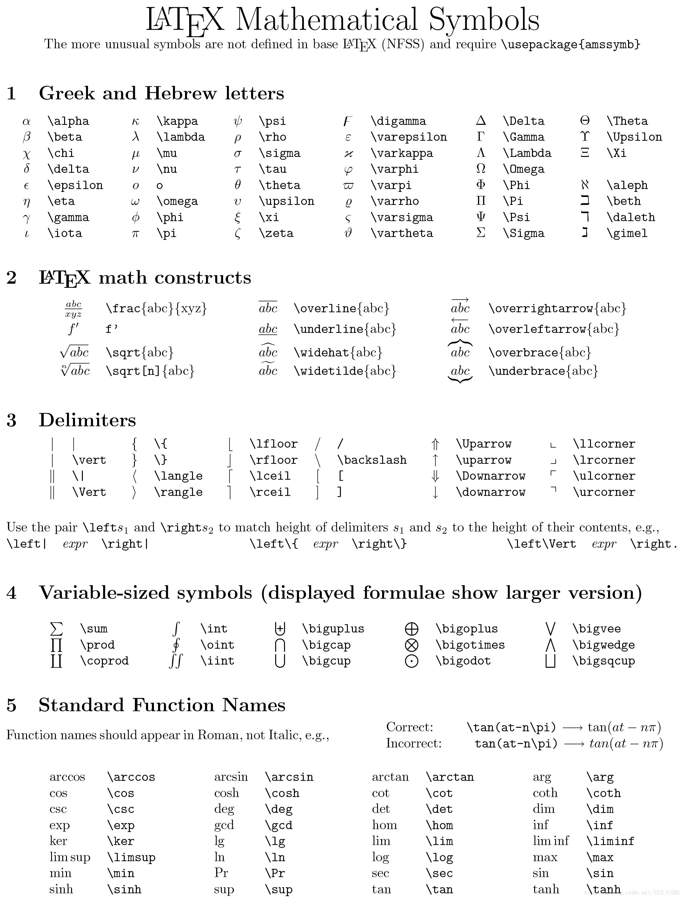
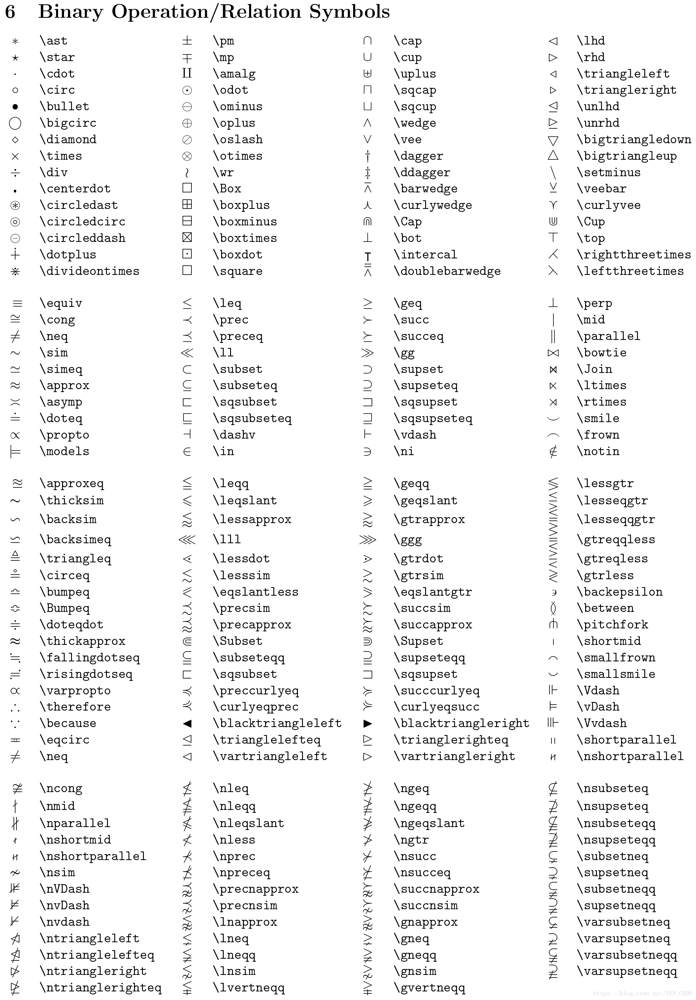

# 教学文档-markdown

作者：吴智悦  
用途：本文档用于 Markdown 的使用教学和编写规范说明

## 1. VScode的安装

直接在[官网](https://code.visualstudio.com/)下载  
下载 .zip 的是免安装的，可以直接启动  
如果下载速度过慢，通过修改 vscode.cdn.azure.cn 镜像网址下载

1. 获取下载链接  
    在官网点击下载后在浏览器的下载内容中右键获取下载地址  
    如： `https://az764295.vo.msecnd.net/stable/e7e037083ff4455cf320e344325dacb480062c3c/VSCode-win32-x64-1.83.0.zip`  
2. 随后将其改为  
   `https://vscode.cdn.azure.cn/stable/e7e037083ff4455cf320e344325dacb480062c3c/VSCode-win32-x64-1.83.0.zip`  

### 1.1 插件配置

在页面左侧最后一个按钮（extension）  
**添加 markdownlint 插件获得 markdown 规范提示！**  
可以将界面通过中文插件 Chinese 设置为中文版本  
可以添加 Github Markdown Preview 使得预览界面和 github 的展示界面相似  
其他推荐：markdown-preview-enhanced  

### 1.2 一些使用小技巧

预览 md ctrl+shift+v 随后拉动到右侧  
选中文字再添加效果，可以直接在两侧添加  

## 2. 基础教学

### 2.1 标题：\#

\# 一级标题  
\#\# 二级标题

### 2.2 换行和段落

空格两个+回车（推荐） 或者 使用(HTML)  <br>
这是一行  
这是下一行
这不是下下一行

这是下一段落 <br>
这是下一行

### 2.3 强调和斜体 （推荐*）

**加粗**  __加粗__  
*斜体*  _斜体_  

**推荐使用\***，因为：  
这不是一个带有_斜体_和__加粗__的句子  
这是一个带有 *斜体* 和 **加粗** 的句子  
___这是一个既斜又粗的句子___  
***这是一个既斜又粗的句子***

### 2.4 删除

~~删除线~~  

### 2.5 引用

>这是一个引用框  
这是下一行  
>>这是一个嵌套的引用框  
    >>这也是一个嵌套的引用框  
        >>>还是一个嵌套  
        ***这是引用框中一个既斜又粗的句子***

在引用框中要注意 tab 的使用，虽然不使用 tab 也能够在页面 preview 中获得一个想要的效果，但是为了 markdown 编写界面的易读性，请好好使用 tab  

### 2.6 列表

1. 有序  
2. 有序  
4. 有序 （虽然标号有问题，但是预览自动修改为3）  

- 无序  （推荐使用 dash - 并使用 tab 来控制级别）  

+ 无序  

* 无序  

1. 有序
    - 无序
        - 无序
    + 无序

### 2.7 代码

这是一个行内代码 `print("Hello! WISERCLUB!")`  
这是一个使用 python 编写的多行代码  

```python
    if name in list:
            print("Hello! WISER!")  #这是一个备注
```

这是一个使用 SQL 编写的多行代码  

```SQL
    CREATE TABLE wiser(
        id CHAR(14)
        name VARCHAR(20)
        age INT,
    ); 
    -- 这是一个备注
```

### 2.8 公式

这是一个行内公式 $E=MC^2$  
这是一个单行公式 $$E(r_p)=r_f+\beta*(r_m-r_f)$$

### 2.9 表格

id | name | age
-|-|-
2022 | wzy | 22

### 2.10 分割线（推荐----）

-----  

*****
_____

### 2.11 链接和引用

[vscode官网](https://code.visualstudio.com/)  
[vscode官网-使用引用][1]  

### 2.12 标注

我们使用的是vscode。 [^1]  
这里是一个标注，会自动拉到最后面排版

注意编码的连续性

### 2.13 导入图片（最好不使用，会产生图片存储问题）

相对地址，不能使用绝对地址  
  
  

>
. 本目录  
.. 父目录  
../.. 祖父目录  

>在 Gitlab 网站中，md1.png 不显示全图，需要点击进入，是因为文件过大，所以注意文件的大小

### 2.14 拓展功能

todo list  

- [ ] to do 1  
- [x] to do 2  

emoji  
:smile:  
:exclamation:  

## 3. 基本规范

可以参考GitHub Flavored Markdown 规范  

1. markdown 文件命名使用 .md 小写字母（除非强调） 用 - 链接
2. 空格
    - 在中文和英文之间、中文和数字之间、数字和单位（除°和%）之间使用空格
        >我们是 WISERCLUB 的一员，是 124 人中的 1 个。  
        而不是：  
        我们是WISERCLUB 的一员，是 124人中的1个。  
    - 链接的前后加空格
    - 斜体、粗体和高亮前后添加空格
    - 转义字符前后添加空格
    - 行内代码、公式两端添加空格
3. 空行
    - 在不同的段落之间使用空行作为分隔，但是不允许出现连续两个以上空行
    - 在文档的末尾 **必须** 添加一个空行
    - 在标题的前后各空一行
    - 代码块（多行代码）前后空一行  
    - 列表前空一行
4. 中文全角，英文和数字半角符号。
5. **简体中文使用直角引号**  
「这是一个『引号』的示范」
[设置直角引号](https://www.zhihu.com/question/19755746#)  
    - 可以通过软键盘  
    - 搜狗输入法输入v1，随后翻找  
    - 【推荐】对自己的输入法设置快捷键  
    如搜狗输入法 设置-输入-高级-自定义短语 如输入「yh」第一个显示「」 第二个显示『』  
6. 专有名词尽量做到规范大小写，如  GitHub、WISERCLUB  
不要随意进行缩写。
7. 注意使用转义字符 \ 规范符号使用  
8. 在每一个 md 文件的头部都至少应当写下一级标题（文件名）和文档用途（简短、精炼，便于阅读）

[1]: https://code.visualstudio.com/  
[^1]: vscode 是xxxx  
