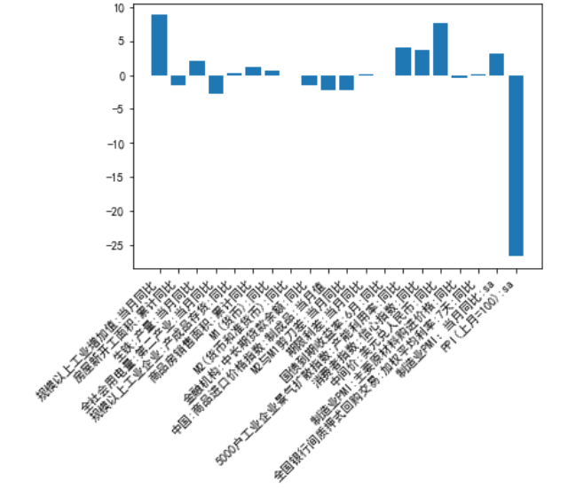
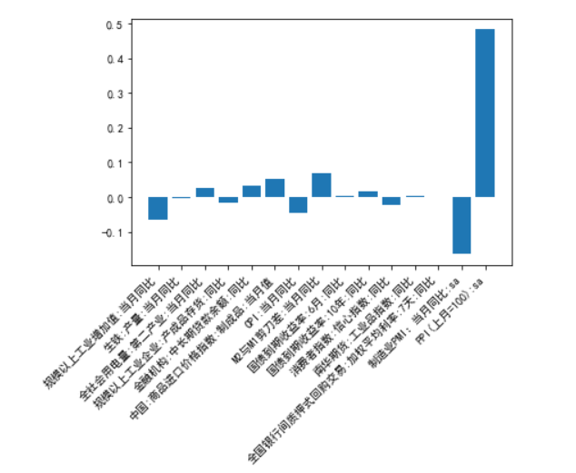
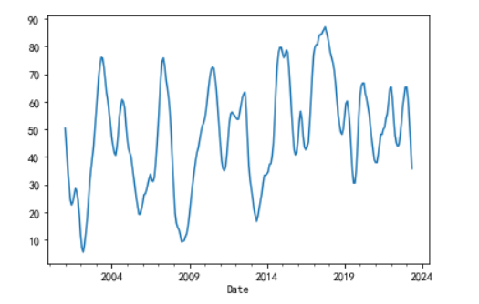
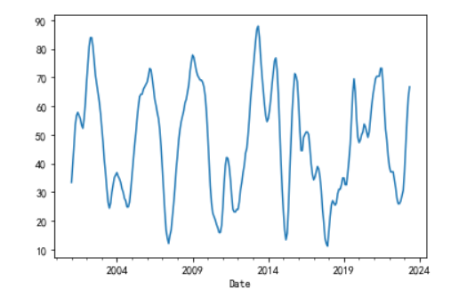
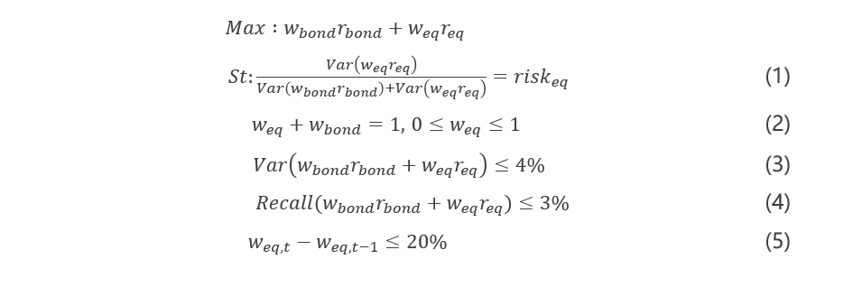
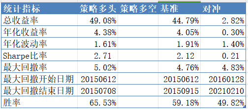
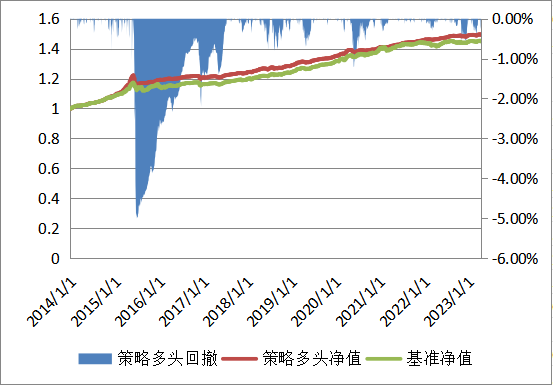
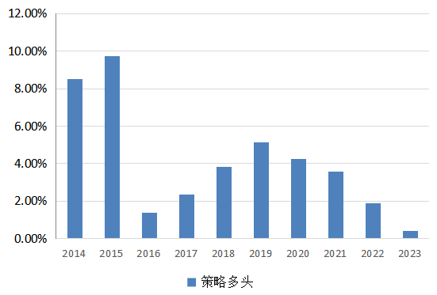

# 基于经济周期的股债择时策略
作者：韩经纬

**摘要**：下文主要分为两个部分，首先对经济周期进行判断，进一步根据对周期的判断构建择时策略进行回测。

## 经济周期划分

**美林时钟**

通胀与经济增长将资产轮动划分成四象限，经济增长决定南北方向而通货膨胀决定东西向，借助象限可以帮助投资者判断哪种资产具有比较优势。即使出现了外部冲击，比如 911 事件改变了美林时钟既定的走向，我们也能通过时钟方向来进行资产比较

+ 来源：张安怡然

**普林格晴雨表**

普林格在《积极型资产配置：指南经济周期分析与六阶段投资时钟》中提到了其依据美国股票、债券和商品三类资产牛熊转换的特性，得出的六大周期。同时在文中，也提及了三类资产牛熊判断的依据：晴雨表。这个晴雨表能够向我们展示某个特定的市场是牛市还是熊市，每个模型包括10余个成分指标,当大多数成分指标对于特定市场都显示出一个积极的模式时,晴雨表自身也会移向一个看涨模式,每个模型都有一个0-100的分数,因此分界线的分数是51。

+ 来源：中泰证券研究所

我参考普林格在书中提及的各类指标选取了26个具有中国市场特点的指标，并结合LASSO回归筛选并构建了针对中国市场的债券晴雨表、股票晴雨表和通货膨胀晴雨表。

### 待筛选指标

|指标名称|发布日期|
:---:|:---:
|制造业PMI:SA|月度数据，每月末发布当月数据|
|规模以上工业增加值:当月同比|月度数据，每月中旬发布上月数据|
|5000户工业企业景气扩散指数:产能利用率:同比|季度数据，每季初发布上一季度数据|
|房屋新开工面积:累计同比|月度数据，每月中旬发布上月数据|
|生铁:产量:当月同比|月度数据，每月中旬发布上月数据|
|粗钢:产量:当月同比|月度数据，每月中旬发布上月数据|
|全社会用电量:第二产业:当月同比|月度数据，每月中旬发布上月数据|
|规模以上工业企业:产成品存货:同比|月度数据，每月中旬发布上月数据|
|消费者指数:信心指数:同比|月度数据，每月末发布上月数据|
|商品房销售面积:累计同比|月度数据，每月中旬发布上月数据|
|国债到期收益率:10年:同比|日度数据，取上月平均值|
|国债到期收益率:6月:同比|日度数据，取上月平均值|
|M1(货币):同比|月度数据，每月中旬发布上月数据|
|M2(货币和准货币):同比|月度数据，每月中旬发布上月数据|
存款类机构质押式回购加权利率:7天|逆回购操作时公布|
|金融机构:中长期贷款余额:同比|月度数据，每月中旬发布上月数据|
|全国银行间质押式回购交易:加权平均利率:7天:同比|月度数据，每月一日发布|
|中间价:美元兑人民币:同比|日度数据，取上月平均值|
|实际有效汇率指数:广义:人民币:同比|月度数据，每月中旬发布上月数据|
|PPI(上月=100):sa|月度数据，每月上旬发布上月数据|
|制造业PMI:主要原材料购进价格:sa|月度数据，每月上旬发布上月数据|
|南华期货:工业品指数:同比|日度数据，取上月平均值|
|沪深300指数(收盘):当月值|日度数据，取前月收盘价|
|CPI:当月同比|月度数据,每月上旬发布上月数据|
|期限利差:同比|日度数据，由6月、10年国债到期收益率计算得出|
|M2与M1剪刀差:同比|月度数据，据M1、M2计算得出|

+ 数据来源：wind

### 指标筛选

1. 将数据统一到月度，根据各指标发布日期进行相应的滞后
2. 将数据调整为同比（其中部分环比数据不进行调整，通过X13对环比数据进行处理）
3. 通过LASSO回归对指标进行筛选

筛选结果：

- Y：**沪深300指数收盘价:环比（也就是月收益率）**

    

- Y：**国债到期收益率:10年:同比**

    

### 晴雨表得分计算 

1. 根据lasso回归中系数的正负进行打分，如果系数为正，则正向打分，反之负向打分。
    - 正向打分：计算每个指标与上月的变化差值，再计算累计12月的均值，表示趋势，趋势小于0，晴雨表分数加2分，反之减2分.
    - 负向打分:计算每个指标与上月的变化差值，再计算累计12月的均值，表示趋势，趋势小于0，晴雨表分数减2分，反之加2分.
2. 在计算晴雨表得分后，按照上述的指标对通货膨胀晴雨表分数进行处理，晴雨表起始分数为0，最后将晴雨表分数求六个月累积均值，再将其依照48个月的窗口大小进行标准化，映射至0-100的分数。
3. 为避免后续择时策略的股债权重在短时间内出现较大变化，计算上述得分的三个月移动平均值。

注：我在此使用2007-2013年固定窗口进行回归，得到回归系数用于后续回测
### 得分情况

**股市晴雨表**

**债券晴雨表**

## 择时策略
1. 根据上述晴雨表得到策略中的股票方差占比，具体计算如下
$$risk_{eq} = max( \frac{股票晴雨表得分}{股票晴雨表得分+债券晴雨表得分},0.999）$$
2. 最大化策略收益对策略进行优化：

+ （1）风险贡献度约束(忽略指数间的相关性);
+ （2）买空卖空约束;
+ （3）组合风险小于4%;
+ （4）最大回撤小于3%;
+ （5）双边换手率小于40%;
+ 除此之外，为缓解极端风险的影响，在优化器迭代过程中，每当组合净值回撤1%，股票风险贡献度调降25%。

**回测**
+ 回测标的：偏股基金指数（930950.CSI）：股票配置基准，中债总财富（1-3年）指数：债券配置基准
+ 回测日期：2014年1月至2023年12月，单月再平衡
+ 手续费：单边3‰
+ 基准策略：10%配置偏股基金指数，90%配置中债总财富（1-3年）

基本情况：
 

策略净值：

股基权重：

### 总结
上文通过识别经济周期对股债权重进行配置，存在如下问题：
+ 从经济周期识别来说，一方面，通过LASSO进行回归来确定打分方向缺少经济逻辑。另一方面，晴雨表打分波动过大，容易出现换手率较高的情况。
+ 从择时策略构建来说，基准资产选择和优化器涉及存在问题，在股债方差差别较大的情况下选择利用方差占比来优化权重的方法并不很好，一方面使得权重过于依赖上一期收益率的方差，同时也使得股票占比较小，年化收益率较小。
+ 从技术上来说，在通过优化器进行优化的过程中，经常出现优化失败的情况，作者也不知道为什么

## 风险提示
1. 策略基于历史数据构建，历史规律可能存在失效的风险
2. 市场可能出现超出模型预期的变化
3. 作者水平不足，可能存在其它意料之外的风险